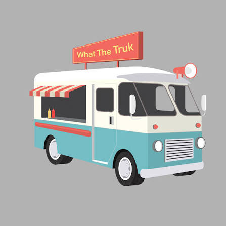

# What The Truk Overview

  

[Link to App Store App](https://apps.apple.com/us/app/whatthetruk/id1483501047)

[Link to Google Play Store App](https://play.google.com/store/apps/details?id=com.whatthetruk.client)

[Link to Company Website](https://www.whatthetruk.com/)

---
## Contents
1. [Overview](#overview)
1. [Technologies](#technologies)
1. [Features](#features)
1. [Challenges](#challenges)
1. [Successes](#successes)
1. [Screenshots](#screenshots)
---

## Overview

I worked as a full-stack developer at What The Truk. I was the primary developer for the features listed here, with design direction and technical support from my supervisor, Evan Tousey. The application source code is private.

What The Truk helps customers find local food trucks and order from them. Vendors use it to publish menus, take orders, and share their current location.

I worked on two apps:

- **Customer app:** A map for finding food trucks, online ordering, and payments.
- **Vendor app:** Menu editing, order management, and location sharing.

I also maintained database logic and wrote code for a custom OAuth server, Google Cloud functions, and automated Mailgun emails.
  
> [Back to the top](#what-the-truk-overview)
---

## Technologies
  - Flutter
  - Dart
  - Firebase
  - Google Cloud Platform
  - NoSQL
  - NodeJS
  - Express
  - Square Payments API
  - OAuth
  - Mailgun
  - Git

> [Back to the top](#what-the-truk-overview)
---

## Features

  I led development of the following features:
  - Secure payment authentication via Square Payments API

  - Vendor Square login authentication via custom OAuth server in NodeJS + Express

  - Live order status push notifications

  - Order status page

  - Menu item modifiers/add-ons

  - Reminder push notifications via Google Cloud Platform CRON jobs

  - Exact food truck addresses via geolocation

  - Order printing

  - Error handling

  - Bug fixes:

    - Fixed incorrect shopping cart and order pricing

    - Fixed food truck locations not updating after initial load

    - Fixed inconsistent push notification delivery

> [Back to the top](#what-the-truk-overview)
---

## Challenges  
 
Flutter, Dart, and the backend stack were new to me when I started. I spent the first week learning the codebase and was adding features, reviewing code, and fixing bugs by the second week. My training at Turing School of Software and Design helped, but working on a production app with hundreds of active users added responsibility I hadn't had in school.
 
> [Back to the top](#what-the-truk-overview)
---
## Successes
 
I learned to work independently in an unfamiliar codebase and deliver features used by customers and vendors. Evan's mentorship also helped me improve my code reviews, documentation, and issue tracking.
  
> [Back to the top](#what-the-truk-overview)
---

## Screenshots

  ### **Secure Payment Authentication**

  

   

  ### **Vendor Square Login Authentication**

  

   

  ### **Live Order Status Push Notifications**

  

   

  ### **Order Status Page**

  

   

  ### **Menu Item Modifiers/Add-ons**

  **Customer App:**

  

  
   
  
  **Vendor App:**

  

   

  ### **Reminder push notifications**

  

   

  ### **Exact Food Truck Addresses**

  

   

  ### **Enhanced Error-Handling**

  

   

> [Back to the top](#what-the-truk-overview)
---
